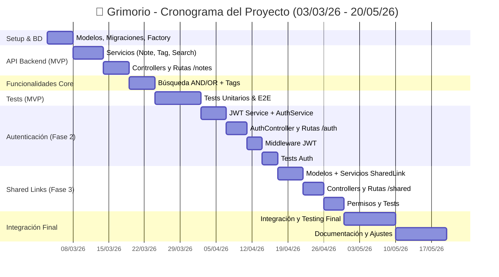

```mermaid
gantt
    title 📅 Grimorio - Cronograma del Proyecto (03/03/26 - 20/05/26)
    dateFormat YYYY-MM-DD
    axisFormat %d/%m/%y
    
    section Setup & BD
    Modelos, Migraciones, Factory      :setup, 2026-03-03, 5d
    
    section API Backend (MVP)
    Servicios (Note, Tag, Search)      :api1, after setup, 6d
    Controllers y Rutas /notes         :api2, after api1, 5d
    
    section Funcionalidades Core
    Búsqueda AND/OR + Tags             :core, after api2, 5d
    
    section Tests (MVP)
    Tests Unitarios & E2E              :test, after core, 9d
    
    section Autenticación (Fase 2)
    JWT Service + AuthService          :auth, after test, 5d
    AuthController y Rutas /auth       :auth2, after auth, 4d
    Middleware JWT                     :auth3, after auth2, 3d
    Tests Auth                         :auth4, after auth3, 3d
    
    section Shared Links (Fase 3)
    Modelos + Servicios SharedLink     :share, after auth4, 5d
    Controllers y Rutas /shared        :share2, after share, 4d
    Permisos y Tests                   :share3, after share2, 4d
    
    section Integración Final
    Integración y Testing Final        :final, after share3, 10d
    Documentación y Ajustes            :doc, after final, 10d
    
```