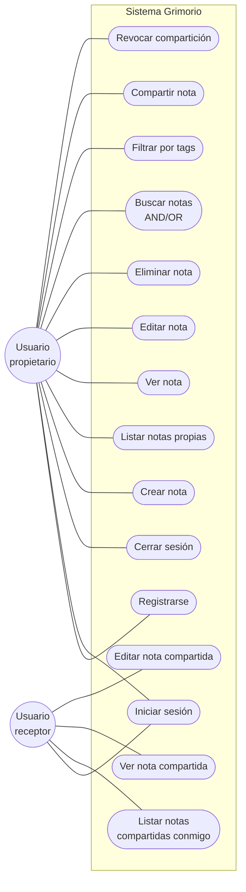
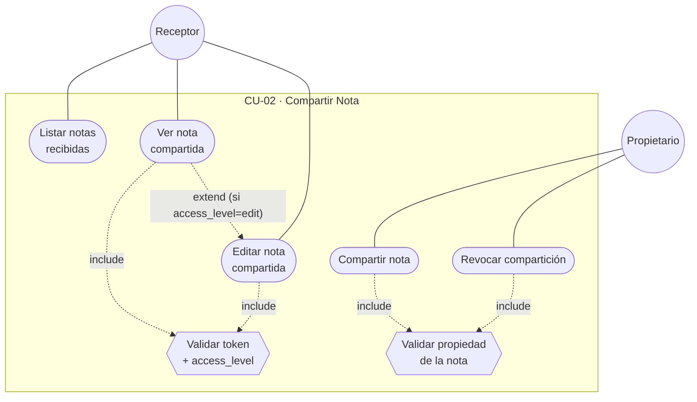
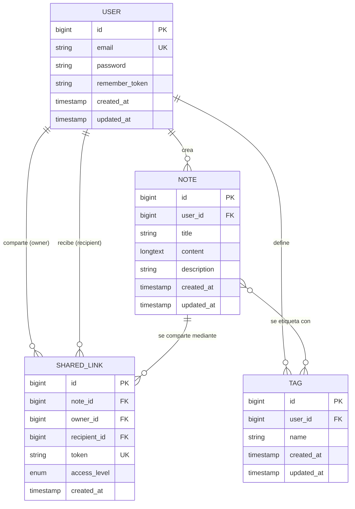
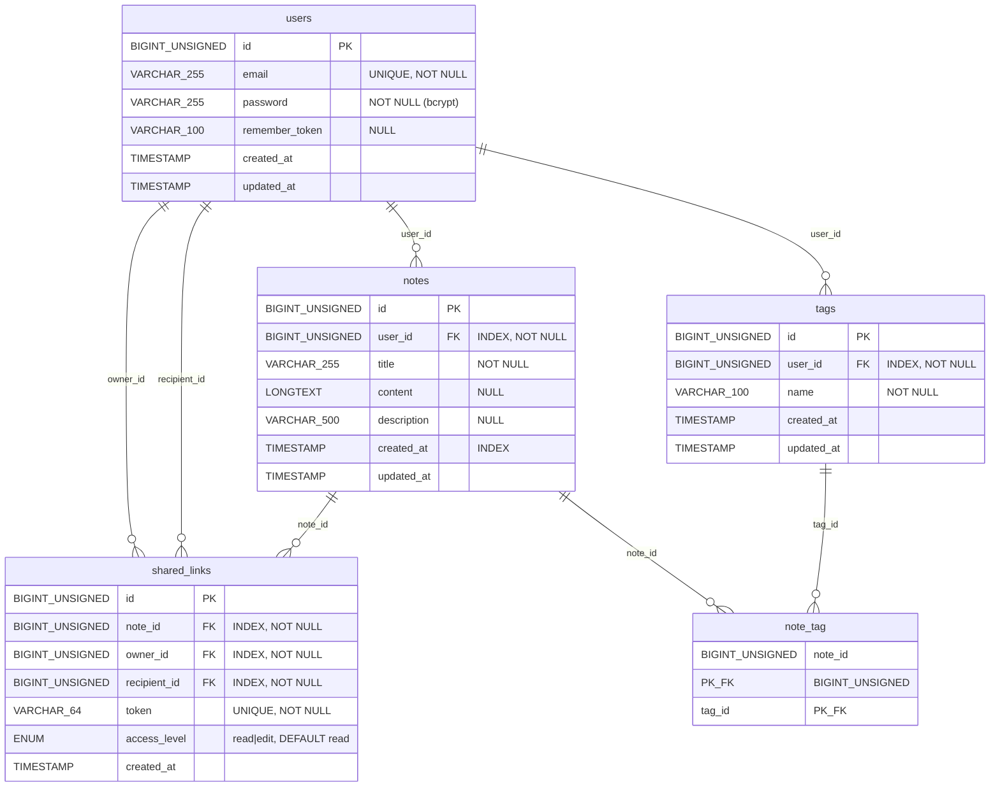
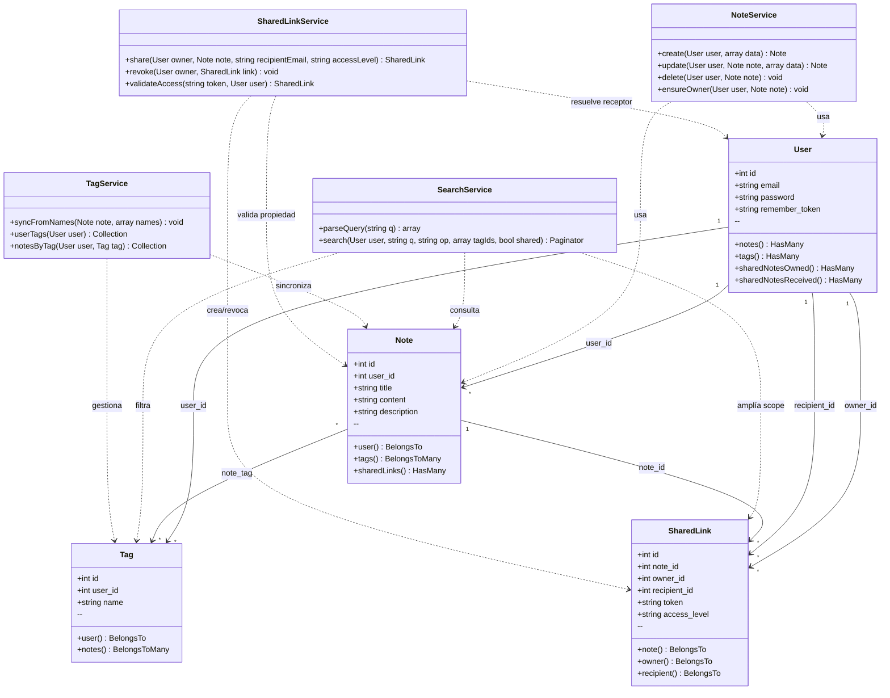
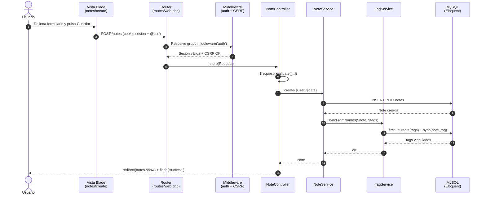
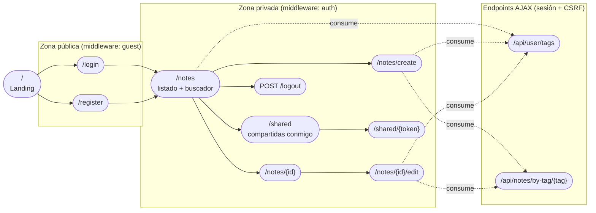

# Memoria PFC – Grimorio

> Aplicación de Notas inspirada en el método Zettelkasten
> Juan José Sáez Blanco · DAW · Curso 2025/2026

---

## 3.1 Estudio de Mercado

El mercado de las aplicaciones de gestión del conocimiento personal (*personal knowledge management*, PKM) ha experimentado un crecimiento significativo en los últimos años, impulsado por el aumento del trabajo remoto, el aprendizaje autodirigido y la adopción de metodologías como *Building a Second Brain* o el ya clásico *Zettelkasten*. Plataformas como **Notion** lideran el segmento generalista, ofreciendo un sistema modular que combina notas, bases de datos, tableros y herramientas colaborativas. Su gran versatilidad es también su principal limitación: la curva de aprendizaje es elevada y la sobrecarga de funciones puede resultar contraproducente para quien busca una solución ágil.

**Obsidian** y **Logseq** se han consolidado como referentes de la corriente *local-first*, basadas en archivos Markdown y orientadas al pensamiento en grafo. Ambas son potentes pero exigen una configuración técnica considerable y carecen de un acceso inmediato desde cualquier dispositivo sin sincronización adicional. **Roam Research** popularizó los enlaces bidireccionales, pero su modelo de suscripción y su ecosistema cerrado han limitado su adopción masiva.

Existe, por tanto, un nicho claro entre la complejidad de Notion y el tecnicismo de Obsidian: usuarios que necesitan registrar ideas en segundos, recuperarlas con rapidez y, opcionalmente, compartirlas. **Grimorio** se posiciona en ese hueco, ofreciendo:

- Acceso 100 % web, sin instalación ni sincronización manual.
- Curva de aprendizaje mínima: una sola pantalla principal y un editor directo.
- Búsqueda con operadores lógicos (AND/OR) y filtrado por *tags*.
- Compartición granular (lectura o edición) entre usuarios autenticados.
- Código abierto, escalable y construido sobre tecnologías estándar (PHP, Laravel).

A diferencia de las soluciones generalistas, Grimorio no pretende sustituir a una *suite* de productividad, sino convertirse en una herramienta especializada y rápida para la captura y consolidación del conocimiento personal.

---

## 3.2 Viabilidad Técnica – Recursos HW, SW y Humanos

### Recursos *Hardware*

El desarrollo se ha llevado a cabo íntegramente sobre un **portátil personal con sistema operativo Windows**, sin necesidad de equipamiento adicional. La elección de un *stack* ligero (PHP + SQLite en desarrollo) permite ejecutar el entorno completo en una máquina convencional, sin requisitos de memoria o procesador especiales.

Para la fase de producción se ha previsto el uso de **Cloudflare** como red de distribución de contenidos (*CDN*) y capa de seguridad, junto con un *hosting* compartido compatible con PHP. Esta infraestructura cubre las necesidades del proyecto (menos de 100 usuarios concurrentes) sin incurrir en costes de servidores dedicados.

### Recursos *Software*

Todo el *software* utilizado es libre o de uso gratuito:

| Herramienta | Versión | Uso |
|---|---|---|
| PHP | 8.5.5 | Lenguaje del *backend* |
| Laravel | 10.50.2 | *Framework* MVC |
| SQLite / MySQL | 3.x / 8.x | Base de datos (desarrollo / producción) |
| Composer | 2.9.7 | Gestor de dependencias PHP |
| Node.js | 22.22.2 | Entorno JavaScript |
| npm | 10.9.7 | Gestor de paquetes Node |
| Vite | 5.0.0 | Compilación de *assets* |
| Git + GitHub | — | Control de versiones |
| Visual Studio Code | — | Editor de código |
| Bootstrap | 5.3 | *Framework* CSS |
| PHPUnit | 10.5.63 | *Testing* unitario y de integración |
| Cypress | 14.3.2 | *Testing* E2E |

### Recursos Humanos

El proyecto es **individual**. El alumno asume todos los roles del ciclo de desarrollo: análisis de requisitos, diseño de la base de datos y la arquitectura, programación *full-stack* (*backend* y *frontend*), pruebas y documentación. Esta concentración de responsabilidades, aunque exigente, garantiza la coherencia del producto y permite tomar decisiones de diseño de forma ágil. La metodología seguida es iterativa, dividiendo el desarrollo en tres fases progresivas (MVP, autenticación y compartición), cada una con su propio ciclo de implementación, prueba y revisión.

---

## 3.4 Viabilidad Temporal

El proyecto se ha planificado en un horizonte de **catorce semanas**, distribuidas según el siguiente diagrama de Gantt (figura X). Las fases han sido diseñadas siguiendo el principio de entrega incremental: cada bloque concluye con una versión funcional y verificable de la aplicación.

| Fase | Semanas | Tareas principales |
|---|---|---|
| **1. Análisis y planificación** | 1–2 | Definición de requisitos, estado del arte, DAFO, redacción de la memoria inicial. |
| **2. Diseño** | 3–4 | Modelo entidad-relación, paso a tablas, diagrama de clases, *mockups* de interfaz. |
| **3. Desarrollo *backend*** | 5–8 | Configuración del entorno Laravel + Sail, migraciones, modelos Eloquent, *controllers*, *services*, validaciones y rutas web. Implementación de la autenticación por sesión y la lógica de compartición. |
| **4. Desarrollo *frontend*** | 9–11 | Vistas Blade, integración con Bootstrap, JavaScript de interactividad puntual (autocompletado de tags, notas relacionadas) y formularios CRUD con CSRF. |
| **5. Testing y documentación** | 12–14 | Pruebas unitarias y de integración, ajustes finales, redacción definitiva de la memoria, despliegue. |

La planificación es **realista y holgada**: se ha reservado una semana extra al final de cada fase para imprevistos y refactorización. El desarrollo iterativo permite además solapar parcialmente las fases (por ejemplo, redactar tests mientras se completa el *frontend*), lo que reduce el riesgo de retrasos. El cronograma respeta el periodo académico de marzo a junio, garantizando la entrega dentro del plazo establecido por el centro.

---

## 4.1 Análisis de Requisitos – Texto explicativo

El análisis de requisitos constituye la base sobre la que se sustenta el resto del proyecto. Su objetivo es traducir las necesidades reales del usuario en especificaciones formales, verificables y trazables a lo largo del desarrollo.

Para Grimorio se ha aplicado una metodología mixta basada en dos enfoques complementarios. En primer lugar, se ha realizado una **fase de elicitación** a partir de la experiencia personal del autor como usuario de aplicaciones de notas (Notion, Google Keep, Obsidian), identificando carencias concretas: lentitud de acceso, sobrecarga de funciones y ausencia de un sistema de etiquetado realmente útil para la metodología *Zettelkasten*. En segundo lugar, se ha llevado a cabo un **análisis comparativo** del estado del arte (apartado 2), del que se extraen las funcionalidades imprescindibles que un producto competitivo debe ofrecer.

Los requisitos resultantes se han clasificado siguiendo la categorización clásica:

- **Requisitos funcionales (RF):** describen las acciones concretas que el sistema debe permitir al usuario.
- **Requisitos no funcionales (RNF):** definen restricciones de calidad, rendimiento, seguridad y usabilidad que el sistema debe cumplir.

Cada requisito está identificado con un código único (`RF-XX`, `RNF-XX`), lo que facilita su trazabilidad en las fases posteriores de diseño, codificación y *testing*. Asimismo, los requisitos se han priorizado en tres niveles —*MVP*, fase 2 (autenticación) y fase 3 (compartición)— para alinearse con la planificación temporal y permitir entregas incrementales con valor real para el usuario final.

Este enfoque modular evita el sobredimensionamiento del sistema y garantiza que cada iteración entregue una versión completa y utilizable.

---

## 4.3 Diagrama de Caso de Uso – Texto explicativo

Los casos de uso se modelan en notación UML estándar, identificando a los actores que interactúan con el sistema y las acciones que estos pueden realizar. En Grimorio se identifican dos actores principales: el **usuario registrado** (propietario de notas) y el **usuario invitado** (receptor de una nota compartida). Ambos comparten algunas acciones (visualizar, editar) pero difieren en sus permisos.

### CU-01 – Gestión de Notas

- **Actor principal:** Usuario registrado.
- **Precondiciones:** El usuario debe estar autenticado (sesión Laravel activa, cookie de sesión válida).
- **Postcondiciones:** Las notas creadas, modificadas o eliminadas quedan reflejadas en la base de datos del usuario.
- **Flujo básico:**
  1. El usuario inicia sesión en `/login` y la sesión se persiste en cookie firmada.
  2. El sistema redirige a `/notes`, donde se listan sus notas paginadas (10/página) ordenadas por fecha de creación descendente.
  3. El usuario selecciona una acción: crear, ver, editar, eliminar o buscar.
  4. La petición se enruta al `NoteController`, que valida el input y delega en `NoteService` o `SearchService`.
  5. El servicio interactúa con el modelo Eloquent y devuelve los datos a la vista Blade.
- **Flujo alternativo:**
  - Si el usuario no está autenticado, el *middleware* `auth` redirige a `/login`.
  - Si la validación falla (título vacío, duplicado, longitud excedida), Laravel devuelve a la vista anterior con `withErrors()` y el formulario muestra los mensajes.

### CU-02 – Compartir Nota

- **Actor principal:** Usuario propietario de la nota.
- **Actor secundario:** Usuario receptor.
- **Precondiciones:** Ambos usuarios deben estar registrados. El propietario debe ser dueño de la nota.
- **Postcondiciones:** Se genera un registro en `shared_links` con un *token* único y un nivel de acceso (`read` o `edit`).
- **Flujo básico:**
  1. El propietario abre la nota y selecciona "Compartir".
  2. Introduce el correo del receptor y el nivel de acceso.
  3. El sistema valida los datos, genera el *token* y persiste el `SharedLink`.
  4. El receptor recibe la URL y, al acceder autenticado, visualiza la nota con los permisos asignados.
- **Flujo alternativo:**
  - Si el receptor no existe, el sistema responde con HTTP 404.
  - Si el propietario revoca el enlace, el registro se elimina y el receptor pierde el acceso inmediatamente.

### 4.3.1 Diagrama general de casos de uso

El siguiente diagrama representa la visión global del sistema, mostrando los dos actores principales y todos los casos de uso identificados, agrupados por dominio funcional.



> El usuario propietario y el usuario receptor son el mismo actor humano en distintos contextos: cualquier usuario registrado puede ser propietario de unas notas y receptor de otras.

### 4.3.2 CU-01 · Gestión de Notas (detalle)

Caso de uso central del sistema. Agrupa el CRUD completo y la búsqueda. Las relaciones `<<include>>` indican pasos obligatorios; `<<extend>>` indica funcionalidad opcional.

```mermaid
flowchart TB
    User((Usuario<br/>registrado))

    subgraph CU01["CU-01 · Gestión de Notas"]
        Login([Iniciar sesión])
        Listar([Listar notas])
        Crear([Crear nota])
        Ver([Ver nota])
        Editar([Editar nota])
        Borrar([Eliminar nota])
        Buscar([Buscar nota])
        Filtrar([Filtrar por tag])
        Auth{{Sesión activa<br/>(middleware auth)}}
    end

    User --- Login
    User --- Listar
    User --- Crear
    User --- Ver
    User --- Editar
    User --- Borrar
    User --- Buscar
    User --- Filtrar

    Listar -. include .-> Auth
    Crear  -. include .-> Auth
    Ver    -. include .-> Auth
    Editar -. include .-> Auth
    Borrar -. include .-> Auth
    Buscar -. include .-> Auth

    Listar -. extend .-> Filtrar
    Listar -. extend .-> Buscar
```

### 4.3.3 CU-02 · Compartición de Notas (detalle)

Implica dos actores. El propietario inicia la compartición; el receptor la consume.



> **Notación:** óvalos = casos de uso, hexágonos = pasos `<<include>>` (obligatorios), líneas discontinuas = relaciones `include`/`extend`. Los actores se representan con círculos.

---

## 5. Diseño

### 5.1 Diseño Conceptual Entidad-Relación

El modelo conceptual identifica cinco entidades —`User`, `Note`, `Tag`, `NoteTag` (asociativa) y `SharedLink`— y las cuatro relaciones que las vinculan. El diagrama ER completo se encuentra en el fichero `ER.drawio` en la raíz del repositorio (figura X). A continuación se incluye una representación equivalente en Mermaid para facilitar su revisión:



**Lectura de las relaciones:**

- Un **usuario** puede crear muchas notas; cada nota pertenece a un único usuario (1:N).
- Un **usuario** define su propio vocabulario de *tags*; los *tags* son privados por usuario (1:N).
- Una **nota** se etiqueta con cero o más *tags* y un *tag* puede aplicarse a varias notas (N:M, materializada en la tabla pivote `note_tag`).
- Un **enlace compartido** (`SharedLink`) une una nota con un usuario receptor distinto del propietario; un mismo usuario puede aparecer simultáneamente como `owner` y como `recipient` en relaciones distintas.
- Las restricciones de unicidad clave (`(user_id, title)` en notas, `(user_id, name)` en tags y `(note_id, recipient_id)` en compartidos) están descritas en detalle en el apartado 5.4.

### 5.2 Diseño Lógico Relacional (Paso a Tablas)

A partir del diagrama entidad-relación se obtiene el siguiente modelo lógico, donde las claves primarias se subrayan y las foráneas se indican con (FK):

- **users** (<u>id</u>, email, password_hash, created_at)
- **notes** (<u>id</u>, user_id (FK→users), title, content, description, created_at, updated_at)
- **tags** (<u>id</u>, user_id (FK→users), tagname, created_at)
- **note_tag** (<u>note_id</u> (FK→notes), <u>tag_id</u> (FK→tags))
- **shared_links** (<u>id</u>, note_id (FK→notes), owner_id (FK→users), recipient_id (FK→users), token, access_level, created_at)

**Restricciones aplicadas:**

- Restricción `UNIQUE (user_id, title)` en `notes`: cada usuario no puede tener dos notas con el mismo título.
- Restricción `UNIQUE (user_id, name)` en `tags`: vocabulario de etiquetas único por usuario.
- Restricción `UNIQUE (token)` en `shared_links`: cada enlace de compartición es irrepetible.
- Restricción `UNIQUE (note_id, recipient_id)` en `shared_links`: una misma nota no puede compartirse dos veces con el mismo destinatario.
- Integridad referencial con `ON DELETE CASCADE` en todas las foráneas: al borrar una nota o un usuario se eliminan en cadena los registros dependientes.
- El campo `access_level` se restringe al ENUM `('read','edit')` a nivel de base de datos.

### 5.3 Diseño Físico o Diagrama MySQL

El modelo físico materializa el diseño lógico en MySQL 8 con motor InnoDB y *charset* `utf8mb4_unicode_ci`. Todas las tablas incluyen claves primarias autoincrementales `BIGINT UNSIGNED`, integridad referencial `ON DELETE CASCADE` y los índices necesarios para optimizar las consultas más frecuentes (listado por fecha, búsqueda por usuario, validación de unicidad y *joins* del pivote).

El diagrama físico generado a partir de las migraciones de Laravel se reproduce en Mermaid:



**Índices y restricciones a nivel físico:**

| Tabla | Índice / Restricción | Tipo | Justificación |
|---|---|---|---|
| `users` | `email` | UNIQUE | Login y unicidad de cuenta. |
| `notes` | `(user_id, title)` | UNIQUE compuesto | Evita duplicados de título por usuario. |
| `notes` | `user_id` | INDEX | Listados por propietario. |
| `notes` | `created_at` | INDEX | Orden descendente en listados. |
| `tags` | `(user_id, name)` | UNIQUE compuesto | Vocabulario único por usuario. |
| `note_tag` | `(note_id, tag_id)` | PK compuesta | Evita duplicados en el pivote. |
| `shared_links` | `token` | UNIQUE | Token de acceso irrepetible. |
| `shared_links` | `(note_id, recipient_id)` | UNIQUE compuesto | Una nota no puede compartirse dos veces con el mismo receptor. |
| `shared_links` | `owner_id`, `recipient_id` | INDEX | Listados “notas que comparto” / “notas compartidas conmigo”. |

En el entorno de *tests* la misma estructura se ejecuta sobre **SQLite en memoria**, con el mismo conjunto de migraciones; las diferencias se limitan al tipo subyacente de las columnas (`INTEGER`/`TEXT`) y a la ausencia de `ENUM`, sustituido por una restricción `CHECK` o validación a nivel de aplicación.

### 5.4 Descripción de Tablas y Campos

#### Tabla `users`

| Campo | Tipo | Restricciones | Descripción |
|---|---|---|---|
| id | BIGINT UNSIGNED | PK, AUTO_INCREMENT | Identificador único del usuario |
| email | VARCHAR(255) | UNIQUE, NOT NULL | Correo electrónico, usado como *login* |
| password | VARCHAR(255) | NOT NULL | *Hash* bcrypt de la contraseña |
| remember_token | VARCHAR(100) | NULL | Token para la funcionalidad *remember me* |
| created_at | TIMESTAMP | NOT NULL | Fecha de registro |
| updated_at | TIMESTAMP | NOT NULL | Última modificación |

#### Tabla `notes`

| Campo | Tipo | Restricciones | Descripción |
|---|---|---|---|
| id | BIGINT UNSIGNED | PK, AUTO_INCREMENT | Identificador único |
| user_id | BIGINT UNSIGNED | FK→users.id, NOT NULL | Propietario de la nota |
| title | VARCHAR(255) | NOT NULL, UNIQUE(user_id, title) | Título visible |
| content | LONGTEXT | NULL | Cuerpo principal de la nota |
| description | VARCHAR(500) | NULL | Resumen opcional |
| created_at | TIMESTAMP | NOT NULL | Fecha de creación |
| updated_at | TIMESTAMP | NOT NULL | Última edición |

#### Tabla `tags`

| Campo | Tipo | Restricciones | Descripción |
|---|---|---|---|
| id | BIGINT UNSIGNED | PK, AUTO_INCREMENT | Identificador único |
| user_id | BIGINT UNSIGNED | FK→users.id, NOT NULL | Propietario del *tag* |
| name | VARCHAR(100) | NOT NULL, UNIQUE(user_id, name) | Nombre de la etiqueta |
| created_at | TIMESTAMP | NOT NULL | Fecha de creación |
| updated_at | TIMESTAMP | NOT NULL | Última modificación |

#### Tabla `note_tag` (pivote N:M)

| Campo | Tipo | Restricciones | Descripción |
|---|---|---|---|
| note_id | BIGINT UNSIGNED | FK→notes.id, PK compuesta | Nota asociada |
| tag_id | BIGINT UNSIGNED | FK→tags.id, PK compuesta | *Tag* asociado |

#### Tabla `shared_links`

| Campo | Tipo | Restricciones | Descripción |
|---|---|---|---|
| id | BIGINT UNSIGNED | PK, AUTO_INCREMENT | Identificador único |
| note_id | BIGINT UNSIGNED | FK→notes.id, NOT NULL | Nota compartida |
| owner_id | BIGINT UNSIGNED | FK→users.id, NOT NULL | Usuario que comparte |
| recipient_id | BIGINT UNSIGNED | FK→users.id, NOT NULL | Usuario receptor |
| token | VARCHAR(64) | UNIQUE, NOT NULL | *Token* hexadecimal de acceso (32 bytes aleatorios) |
| access_level | ENUM('read','edit') | NOT NULL, DEFAULT 'read' | Nivel de permiso |
| created_at | TIMESTAMP | NOT NULL | Fecha de compartición |

### 5.5 Orientación a Objetos

El código se estructura siguiendo los principios de la programación orientada a objetos: cada modelo Eloquent es una clase que representa una entidad del dominio, y cada *service* encapsula la lógica de negocio asociada a una funcionalidad. Las relaciones entre clases reflejan las del modelo entidad-relación del apartado 5.1.

#### 5.5.1 Diagrama de Clases

Se representan los modelos de dominio (en `app/Models`) y los *services* (en `app/Services`) que orquestan su uso. Por brevedad, los métodos *getter*/*setter* generados automáticamente por Eloquent y los *casts* estándar (`created_at`, `updated_at`) se omiten.



**Descripción de las clases principales:**

- **`User`** — representa al usuario autenticado. Hereda de `Authenticatable` para integrarse con el sistema de sesiones de Laravel. Posee colecciones de notas y tags propios y dos relaciones distintas con `SharedLink`: como propietario y como receptor.
- **`Note`** — entidad central. Pertenece a un único usuario y mantiene relaciones N:M con `Tag` (a través del pivote `note_tag`) y 1:N con `SharedLink`.
- **`Tag`** — etiqueta privada por usuario; permite agrupar y filtrar notas siguiendo el principio Zettelkasten.
- **`SharedLink`** — vincula una nota con un usuario receptor distinto del propietario, con un nivel de acceso (`read` / `edit`) y un token único de 64 caracteres.
- **`NoteService`** — encapsula el CRUD de notas y centraliza la verificación de propiedad mediante `ensureOwner()`.
- **`SearchService`** — parsea la cadena de consulta y construye dinámicamente el *query builder* en función del operador, los tags seleccionados y el flag `shared`.
- **`TagService`** — gestiona la creación de tags (`firstOrCreate`), su sincronización con notas y la consulta de notas previas asociadas a un tag (alimenta el panel de “notas relacionadas”).
- **`SharedLinkService`** — controla la lógica de compartición: generación del token con `bin2hex(random_bytes(32))`, validación cruzada por `token` y `recipient_id`, y revocación.

#### 5.5.2 Diagrama de Secuencia – Crear Nota

El proceso de creación de una nota se desarrolla a través del flujo clásico de Laravel basado en sesiones:

1. **Usuario** rellena el formulario en la vista `notes/create.blade.php` (campo de título, descripción, contenido y *tags*) y pulsa “Guardar”.
2. El navegador envía una petición `POST /notes` que incluye automáticamente la cookie de sesión y el *token* CSRF generado por la directiva `@csrf` de Blade.
3. **Laravel Router** (`routes/web.php`) entrega la petición al grupo `middleware('auth')`, que comprueba que el usuario tiene una sesión activa; en caso contrario redirige a `/login`.
4. **`VerifyCsrfToken`** valida el *token* del formulario; si no coincide, devuelve HTTP 419.
5. **`NoteController::store()`** valida los datos de entrada con `$request->validate()` (título requerido y único por usuario, longitud máxima de descripción) y delega en el servicio.
6. **`NoteService::create()`** crea la nota a través de la relación `auth()->user()->notes()->create()`, garantizando que el `user_id` siempre se corresponde con el usuario autenticado.
7. **`TagService::syncFromNames()`** convierte la lista de *tags* tecleados (separados por comas) en registros de `tags` y los enlaza a la nota mediante el pivote `note_tag`.
8. **Eloquent** ejecuta los `INSERT` correspondientes sobre **MySQL**.
9. El controlador responde con un `redirect()->route('notes.show', $note)` que carga la vista de detalle y muestra un mensaje *flash* de éxito.

Este flujo refleja la separación de responsabilidades del patrón MVC: el *controller* orquesta y valida, los *services* aplican la lógica de negocio y los *models* persisten los datos.



#### 5.5.3 Diagrama de Actividad – Búsqueda de Notas

La búsqueda se modela como una actividad con bifurcaciones según el operador y los filtros seleccionados:

1. **Inicio:** el usuario introduce una cadena en el campo de búsqueda de `/notes`, opcionalmente selecciona el operador (AND/OR), marca *tags* y/o el filtro “Incluir compartidas conmigo”.
2. **Petición HTTP:** el formulario envía `GET /notes?q=<query>&op=AND|OR&tags[]=<id>&shared=1`.
3. **`SearchService::parseQuery()`** divide la cadena en términos por espacios o por los operadores explícitos `AND`/`OR`.
4. **Construcción del *query builder*:**
   - *Scope* base: notas propias (`user_id == auth user`); si `shared=1`, se añade un `OR WHERE id IN (SELECT note_id FROM shared_links WHERE recipient_id = auth user)`.
   - **AND:** cada término se aplica en un `WHERE` anidado con `LIKE '%término%'` sobre `title`, `content` y `description`.
   - **OR:** los `LIKE` se agrupan dentro de un `orWhere` para que basten coincidencias parciales.
5. **Filtro por *tags*:** cada *tag* seleccionado añade un `whereHas('tags', ...)` adicional, lo que produce una lógica AND entre etiquetas (la nota debe tenerlas todas).
6. **Ejecución:** la consulta resultante se pagina (10 notas por página, ordenadas por `created_at` descendente) y se serializa hacia la vista junto con los filtros activos para conservar el estado entre páginas (`withQueryString()`).
7. **Renderizado:** `notes/index.blade.php` muestra la lista; el JavaScript de la vista resalta los filtros activos y permite añadir/quitar *tags* sin recargar la búsqueda.

No se utilizan índices `FULLTEXT` de MySQL: dada la escala objetivo (<100 usuarios), el operador `LIKE %término%` ofrece una respuesta inmediata con la ventaja de funcionar también sobre el campo `description` y de mantener la portabilidad hacia SQLite, utilizado en *tests*.

```mermaid
flowchart TD
    Start([Inicio: usuario en /notes])
    Input[/Introduce query, op,<br/>tags y flag shared/]
    GET[GET /notes?q=...&op=...<br/>&tags[]=...&shared=1]
    Parse[SearchService::parseQuery<br/>tokens]
    Empty{¿query vacía?}
    Op{operador?}
    AndW[WHERE LIKE término1<br/>AND LIKE término2 ...]
    OrW[WHERE LIKE término1<br/>OR LIKE término2 ...]
    Tags{¿tags<br/>seleccionados?}
    WhereHas[whereHas tags<br/>cada tag suma AND]
    Shared{¿shared=1?}
    Union[UNION con notas<br/>de shared_links<br/>donde recipient=auth]
    Owner[Scope user_id =<br/>auth user]
    Page[paginate 10 +<br/>orderBy created_at desc]
    Render[Render notes/index.blade<br/>con filtros activos]
    End([Fin])

    Start --> Input --> GET --> Parse --> Empty
    Empty -- Sí --> Owner
    Empty -- No --> Op
    Op -- AND --> AndW --> Tags
    Op -- OR  --> OrW  --> Tags
    Tags -- Sí --> WhereHas --> Shared
    Tags -- No --> Shared
    Shared -- Sí --> Union --> Page
    Shared -- No --> Owner --> Page
    Page --> Render --> End
```

### 5.6 Mapa Web

La navegación de Grimorio se estructura en tres zonas: pública, autenticación y privada.

```
/                          → Landing page (home pública)
├── /login                 → Formulario de inicio de sesión      (middleware: guest)
├── /register              → Formulario de registro              (middleware: guest)
└── (zona autenticada, middleware: auth)
    ├── POST /logout       → Cierre de sesión
    ├── /notes             → Listado, búsqueda y filtros
    ├── /notes/create      → Creación de nota
    ├── /notes/{id}        → Detalle
    ├── /notes/{id}/edit   → Edición
    ├── /shared            → Notas compartidas conmigo
    ├── /shared/{token}    → Lectura de nota compartida
    ├── /api/user/tags     → (AJAX) tags del usuario para autocompletado
    └── /api/notes/by-tag  → (AJAX) notas previas asociadas a un tag
```

El acceso a la zona autenticada lo controla el *middleware* `auth` de Laravel, que comprueba la sesión activa en cada petición. Las rutas públicas (`/`, `/login`, `/register`) usan en cambio el alias `guest`, que redirige al usuario a `/notes` si ya tiene sesión iniciada. Los *endpoints* AJAX se publican deliberadamente en `routes/web.php` (no en `routes/api.php`) para reutilizar la cookie de sesión y la protección CSRF de Laravel sin complicar la autenticación.

El siguiente diagrama representa visualmente la jerarquía de pantallas y los *middleware* aplicados a cada zona:



### 5.7 Mockups

Los *mockups* recogen las pantallas principales de la aplicación y sirven como guía visual de la implementación Blade. A continuación se describen las cinco vistas clave; las imágenes correspondientes se incluyen como figuras del documento final.

> [PENDIENTE: incrustar las imágenes de los *mockups* exportados desde la herramienta de diseño (Figma / draw\.io). Cada figura debe enumerarse y referenciarse en el texto.]

**M-01 — Login / Registro.** Formulario centrado con campos *email* y *password*, botón primario y enlace al modo opuesto. Mensajes de error en *flash* sobre el formulario tras un intento fallido. Mantiene la estética minimalista y prioriza la legibilidad.

```
+---------------------------------------------------+
|                    GRIMORIO                       |
|---------------------------------------------------|
|                                                   |
|        Email     [____________________]           |
|        Password  [____________________]           |
|                                                   |
|                  [   ENTRAR   ]                   |
|                                                   |
|         ¿No tienes cuenta? > Registrarse          |
+---------------------------------------------------+
```

**M-02 — Listado de notas (`/notes`).** Vista principal tras el *login*. En la cabecera se sitúa el buscador con campo de texto, selector AND/OR, *chips* de *tags* activos y el flag “Incluir compartidas conmigo”. Debajo, las notas se listan en *cards* paginados (10 por página), con título, fecha y *tags*. Botón flotante “+ Nueva nota” en la esquina inferior derecha.

```
+---------------------------------------------------+
| GRIMORIO    [Buscar...] [AND v]  [shared] [Buscar]|
| Tags activos: #php  #laravel  (x)                 |
|---------------------------------------------------|
| [Card] Título nota 1   #tag1 #tag2     04/05/2026 |
| [Card] Título nota 2   #tag3           02/05/2026 |
| [Card] Título nota 3   #tag1           28/04/2026 |
|                                                   |
|              <  1  2  3  ...  >                   |
|                                                   |
|                                       [ + Nueva ] |
+---------------------------------------------------+
```

**M-03 — Creación / Edición de nota (`/notes/create`, `/notes/{id}/edit`).** Formulario con campos *title*, *description* y *content*. A la derecha, un panel lateral con el campo de *tags* (autocompletado vía `/api/user/tags`) y, debajo, la lista dinámica de “Notas relacionadas” que se rellena al añadir un *tag* mediante `/api/notes/by-tag/{tag}`. Botones “Guardar” y “Cancelar” al pie.

```
+----------------------------------+--------------------+
| Título     [______________]      |  TAGS              |
| Descripción[______________]      |  [#php] [#zettel]+ |
| Contenido                        |--------------------|
| +----------------------------+   |  Notas relacionadas|
| |                            |   |  - Nota A          |
| |                            |   |  - Nota B          |
| +----------------------------+   |  - Nota C          |
|                                  |                    |
|        [ Cancelar ] [ Guardar ]  |                    |
+----------------------------------+--------------------+
```

**M-04 — Detalle de nota (`/notes/{id}`).** Cabecera con título, fechas (creación / última edición) y *tags*. Cuerpo con el contenido renderizado. Barra de acciones lateral: “Editar”, “Compartir”, “Eliminar”. Al pulsar “Compartir” se abre un *modal* que pide *email* del receptor y nivel de acceso (`read` / `edit`).

```
+-----------------------------------------------------+
| Título de la nota                  [Editar]         |
| #tag1 #tag2  ·  Creada 02/05/2026  [Compartir]      |
|                                    [Eliminar]      |
|-----------------------------------------------------|
|  Contenido de la nota...                            |
|  ...                                                |
+-----------------------------------------------------+
```

**M-05 — Notas compartidas conmigo (`/shared`) y vista por *token* (`/shared/{token}`).** Listado equivalente al de `/notes`, pero filtrado a notas en las que el usuario actual figura como `recipient_id`. La vista por *token* renderiza la nota en modo lectura o edición según el `access_level` del enlace.

```
+-----------------------------------------------------+
| Compartidas conmigo                                 |
|-----------------------------------------------------|
| [Card] Título nota X   por: alice@x  (read)         |
| [Card] Título nota Y   por: bob@y    (edit)         |
+-----------------------------------------------------+
```

El estilo visual final sigue la paleta de Bootstrap 5.3 con pequeñas personalizaciones (tipografía, espaciado y *cards*). Los *mockups* se han validado iterativamente durante el desarrollo Blade, garantizando que cada componente tenga un equivalente directo en HTML/CSS sin necesidad de JavaScript adicional salvo en los puntos de autocompletado descritos.

---

## 6. Codificación

### 6.1 Tecnologías Elegidas y Justificación

**Laravel 10** se ha seleccionado como *framework* principal por su madurez, su comunidad activa y su conjunto de herramientas listas para producción: ORM Eloquent, sistema de migraciones, *router* expresivo, *middleware*, validación integrada y autenticación por sesión incorporada de serie. Estas características reducen drásticamente el código repetitivo y favorecen el cumplimiento de buenas prácticas (*convention over configuration*).

**Blade** se ha escogido frente a una arquitectura SPA (*Single Page Application*) por la naturaleza del proyecto: una aplicación con pocas vistas y poca interactividad compleja, donde el coste de mantener un *frontend* en React o Vue no se justifica. Blade ofrece *server-side rendering* nativo, herencia de plantillas (`@extends`, `@section`) y una integración perfecta con Laravel, incluyendo la directiva `@csrf` que asegura los formularios automáticamente.

**Sesiones nativas de Laravel** se han elegido para la autenticación tras evaluar y descartar la implementación inicial con JWT. La aplicación no expone una API consumida desde clientes externos (no hay móvil ni SPA), por lo que las cookies firmadas y la protección CSRF que ofrece el grupo de *middleware* `web` resultan más simples, más seguras por defecto y eliminan la complejidad de gestionar *refresh tokens*, expiraciones cortas o listas de revocación. La rama `proyectosinJWT` recoge esta decisión y elimina la dependencia `tymon/jwt-auth`.

**Bootstrap 5.3** y CSS propio se utilizan para componer la interfaz, aportando un sistema responsive accesible sin necesidad de partir de cero.

**MySQL 8** es la base de datos de desarrollo y producción, levantada mediante **Laravel Sail** (Docker) durante el desarrollo. Para los *tests* automáticos se utiliza **SQLite en memoria** (`:memory:`), lo que permite ejecutar la suite completa sin estado residual y en cuestión de segundos.

**Vite** sustituye al ya obsoleto Laravel Mix para la compilación de *assets* y el *hot module reload* en desarrollo.

### 6.2 Entorno Servidor – Descripción General

El *backend* sigue una arquitectura **MVC estándar de Laravel**, con el código organizado por capas según la convención del *framework*:

```
app/
├── Http/
│   ├── Controllers/
│   │   ├── AuthController.php
│   │   ├── NoteController.php
│   │   └── SharedLinkController.php
│   ├── Middleware/
│   │   ├── Authenticate.php
│   │   ├── RedirectIfAuthenticated.php   (alias `guest`)
│   │   ├── RateLimitLogin.php            (alias `rate.login`)
│   │   └── VerifyCsrfToken.php
│   └── Kernel.php
├── Services/
│   ├── NoteService.php
│   ├── SearchService.php
│   ├── TagService.php
│   └── SharedLinkService.php
└── Models/
    ├── User.php
    ├── Note.php
    ├── Tag.php
    └── SharedLink.php
```

Esta organización por capas (en lugar de por *features*) refuerza la legibilidad para cualquier desarrollador familiarizado con Laravel y simplifica la búsqueda de un fichero por su responsabilidad. La lógica de negocio se concentra en los *services*; los *controllers* se limitan a recibir la petición, validar el *input* y delegar.

El **ciclo de vida de una *request*** sigue las fases estándar de Laravel: `public/index.php` recibe la petición; el *kernel* HTTP la procesa aplicando el grupo de *middleware* `web` (cookies, sesión, errores, CSRF); el *router* la dirige a la ruta correspondiente; los *middleware* de ruta (`auth`, `guest`, `throttle`) actúan; el *controller* delega en el *service*; este invoca al *model* y la respuesta viaja en sentido inverso renderizada en Blade. La separación *controller / service / model* garantiza que la lógica de negocio sea testeable de forma aislada.

### 6.3 Seguridad

La seguridad de Grimorio se aborda en varias capas:

- **Validación de entrada:** todas las peticiones se validan en el *controller* mediante `$request->validate()`, definiendo reglas estrictas de tipo, longitud y formato. Esto previene la inyección de datos malformados antes de llegar al modelo.
- **Hashing de contraseñas:** las contraseñas se almacenan exclusivamente como *hashes* bcrypt. El modelo `User` declara `'password' => 'hashed'` en `$casts`, por lo que la asignación masiva delega automáticamente en `Hash::make()`. La verificación se realiza con `Auth::attempt()`, resistente a ataques por tiempo.
- **Sesiones firmadas y CSRF:** las cookies de sesión se firman con `APP_KEY`, son `HttpOnly` y, en producción con HTTPS, `Secure`. Cada formulario incluye `@csrf`, lo que activa la verificación por `VerifyCsrfToken` y bloquea CSRF.
- **Regeneración de sesión:** tras cada login y logout se invoca `session()->regenerate()` o `invalidate()` y `regenerateToken()`, mitigando ataques de fijación de sesión.
- **Rate limiting:** la ruta `POST /login` está protegida con el *middleware* `throttle:5,1`, que limita los intentos a cinco por minuto y por IP, dificultando ataques de fuerza bruta.
- **Prevención de inyección SQL:** todas las consultas se construyen con Eloquent o el *Query Builder*, que utilizan *prepared statements*. No se concatenan cadenas en SQL crudo en ningún punto del código.
- **Autorización por usuario:** cada *service* aplica filtros por `user_id` (`NoteService::ensureOwner`) o por `recipient_id` (`SharedLinkService::validateAccess`) antes de cualquier operación, garantizando que un usuario nunca pueda acceder a notas que no le pertenezcan o se hayan compartido con él.
- **Token de compartición no adivinable:** los enlaces compartidos usan un identificador de 32 bytes aleatorios (`bin2hex(random_bytes(32))`), suficientemente largo para resistir búsquedas por fuerza bruta.

### 6.4 Entorno Cliente – Descripción General

El *frontend* combina **Blade** para la estructura HTML y **JavaScript vanilla** para los puntos específicos de interactividad. No existe SPA: cada acción recarga la página o aprovecha un *endpoint* AJAX puntual.

La autenticación es **transparente para el cliente**: la cookie de sesión se gestiona automáticamente por el navegador y los formularios incluyen el *token* CSRF que Laravel verifica en el servidor. Esto elimina la necesidad de almacenar credenciales en `localStorage` y de adjuntar manualmente cabeceras `Authorization`, evitando los riesgos asociados (XSS exfiltrando el *token*).

La interacción dinámica se concentra en dos puntos:

- **Autocompletado de *tags***: al tipear en el campo de tags se consulta `GET /api/user/tags` para sugerir etiquetas existentes del usuario.
- **Notas relacionadas al elegir un tag**: cuando se añade un tag al crear una nota, se consulta `GET /api/notes/by-tag/{tag}` para mostrar al lado las notas previas asociadas a ese tag, reforzando el principio Zettelkasten de descubrir conexiones en el momento de escribir.

Ambos *endpoints* están declarados en `routes/web.php`, no en `routes/api.php`, precisamente para reutilizar la sesión y CSRF.

### 6.5 Documentación Interna de Código

A continuación se describen los ficheros más relevantes del proyecto:

| Fichero | Función |
|---|---|
| `routes/web.php` | Único fichero de rutas activo. Agrupa rutas públicas, de invitado (`guest`) y autenticadas (`auth`) en bloques separados. |
| `app/Http/Controllers/AuthController.php` | Maneja registro, *login* (con `Auth::attempt`), *logout* (con `session()->invalidate()`) y la regeneración de sesión. |
| `app/Http/Controllers/NoteController.php` | Recibe las peticiones del CRUD de notas y de la búsqueda; valida el *input* y delega en `NoteService`, `SearchService` o `TagService`. Publica además los dos *endpoints* AJAX. |
| `app/Http/Controllers/SharedLinkController.php` | Crea, revoca y consume enlaces de compartición; renderiza la vista de notas compartidas conmigo y la lectura/edición por *token*. |
| `app/Services/NoteService.php` | Lógica de negocio CRUD de notas; centraliza la comprobación `ensureOwner` para impedir accesos cruzados. |
| `app/Services/SearchService.php` | Parsea la cadena de búsqueda con `parseQuery()`, distingue AND/OR y construye dinámicamente la consulta Eloquent con filtros de tags y opción de incluir notas compartidas. |
| `app/Services/TagService.php` | Gestión de *tags*: creación con `firstOrCreate`, sincronización por nombres, consulta de etiquetas y notas previas asociadas. |
| `app/Services/SharedLinkService.php` | Crea/revoca enlaces de compartición y valida el acceso por `token` y `recipient_id`. Genera *tokens* hexadecimales de 64 caracteres. |
| `app/Http/Middleware/Authenticate.php` | Alias `auth`; redirige a `/login` cuando no hay sesión. |
| `app/Http/Middleware/RedirectIfAuthenticated.php` | Alias `guest`; impide acceder a `/login` y `/register` cuando ya hay sesión. |
| `app/Http/Middleware/RateLimitLogin.php` | Aplica un *throttle* sobre el *login* (5 intentos/minuto por IP). |
| `resources/views/layouts/*.blade.php` | Plantillas base con la *navbar*, mensajes *flash* y bloques `@yield`. |
| `resources/views/notes/*.blade.php` | Vistas del CRUD: listado con filtros, formulario de creación, detalle y formulario de edición. |
| `resources/views/shared/*.blade.php` | Listado de notas compartidas conmigo y detalle por *token*. |

Cada fichero PHP incluye una cabecera con el *namespace* y, cuando procede, comentarios PHPDoc breves sobre parámetros y excepciones lanzadas.

---

## 7. Despliegue

### 7.1 Diagrama de Despliegue

La arquitectura de despliegue de Grimorio se compone de cuatro capas:

```
┌─────────────────┐      HTTPS      ┌──────────────────┐
│   Cliente Web   │◄───────────────►│  Cloudflare CDN  │
│   (navegador)   │                 │  (caché + WAF)   │
└─────────────────┘                 └─────────┬────────┘
                                              │
                                              ▼
                                    ┌──────────────────┐
                                    │  Servidor Web    │
                                    │  (Apache/Nginx)  │
                                    └─────────┬────────┘
                                              │
                                              ▼
                                    ┌──────────────────┐
                                    │      PHP-FPM     │
                                    │   + Laravel 10   │
                                    └─────────┬────────┘
                                              │
                                              ▼
                                    ┌──────────────────┐
                                    │   MySQL 8.x      │
                                    │   (producción)   │
                                    └──────────────────┘
```

El cliente accede a través de **HTTPS** a Cloudflare, que actúa como CDN, capa de seguridad (WAF) y proxy hacia el servidor de origen. Este último ejecuta Apache o Nginx como *front* HTTP, delegando la ejecución de PHP en **PHP-FPM**. Laravel se conecta a una base de datos **MySQL** mediante PDO. En desarrollo local, este esquema se simplifica a un único proceso `php artisan serve` con SQLite.

### 7.2 Descripción de la Instalación

El despliegue manual sigue los pasos siguientes:

1. Clonar el repositorio:

   ```bash
   git clone https://github.com/<usuario>/grimorio.git
   cd grimorio
   ```

2. Instalar dependencias PHP:

   ```bash
   composer install --no-dev --optimize-autoloader
   ```

3. Copiar y configurar el fichero de entorno:

   ```bash
   cp .env.example .env
   php artisan key:generate
   ```

4. Editar `.env` con las credenciales reales (BD, `APP_URL`, configuración de sesión).
5. Ejecutar migraciones:

   ```bash
   php artisan migrate --force
   ```

6. Compilar *assets*:

   ```bash
   npm install && npm run build
   ```

7. Levantar el servidor (desarrollo) o configurar el *virtual host* (producción):

   ```bash
   php artisan serve   # desarrollo
   ```

   Como alternativa preferida en desarrollo se utiliza **Laravel Sail**, que orquesta los contenedores de PHP, MySQL y phpMyAdmin con un solo comando: `./vendor/bin/sail up -d`.

### 7.3 Fichero de Configuración

El fichero `.env` centraliza toda la configuración sensible y específica del entorno. Las variables más relevantes son:

```dotenv
APP_NAME=Grimorio
APP_ENV=production
APP_KEY=base64:...
APP_DEBUG=false
APP_URL=https://grimorio.example.com

DB_CONNECTION=mysql
DB_HOST=127.0.0.1
DB_PORT=3306
DB_DATABASE=grimorio
DB_USERNAME=grimorio_user
DB_PASSWORD=********

SESSION_DRIVER=file
SESSION_LIFETIME=120
SESSION_SECURE_COOKIE=true
```

`APP_KEY` se utiliza para encriptar y firmar las cookies de sesión y los datos sensibles que Laravel maneja internamente; nunca debe filtrarse al repositorio. En producción, `APP_DEBUG` se mantiene en `false` para no exponer trazas de error y `SESSION_SECURE_COOKIE=true` exige cookies de sesión exclusivamente sobre HTTPS.

### 7.4 Hosting

Para la fase de producción se ha optado por un esquema basado en **Cloudflare** como capa intermedia, combinada con un *hosting* compartido económico compatible con PHP 8 y MySQL. Cloudflare ofrece de forma gratuita:

- Certificado SSL/TLS automático.
- CDN global con caché de *assets* estáticos.
- Protección DDoS y *firewall* de aplicación web (WAF).
- Reglas de redirección y reescritura.

Esta configuración cubre con holgura las necesidades del proyecto (menos de 100 usuarios concurrentes esperados) sin incurrir en costes elevados, y permite escalar a un VPS dedicado en caso de crecimiento.

> [PENDIENTE: URL de acceso, usuario y contraseña de prueba para el tribunal, una vez desplegada la versión final.]

---

## 8. Herramientas de Apoyo

### Control de Versiones

El proyecto se gestiona con **Git** y se aloja en **GitHub**. Se ha seguido un flujo de trabajo simple basado en una rama `main` estable y ramas temáticas (`feature/*`, `fix/*`) para cada nueva funcionalidad o corrección. Los *commits* siguen un estilo descriptivo (verbo en infinitivo + descripción corta), facilitando la trazabilidad del histórico.

### Sistemas de Integración Continua

Aunque no se ha configurado un *pipeline* CI/CD para esta versión del proyecto, GitHub permite añadir fácilmente *workflows* mediante GitHub Actions en futuras iteraciones, lo que permitiría ejecutar automáticamente PHPUnit y Cypress en cada *push*.

### Gestión de Pruebas

El plan de pruebas se estructura en tres niveles:

- **Pruebas unitarias (PHPUnit):** verifican componentes aislados como `SearchService::parseQuery()` (operadores AND/OR, espacios múltiples, cadena vacía) y la asignación correcta de campos en el modelo `Note`.
- **Pruebas de integración (Feature Tests):** validan flujos completos a nivel HTTP usando SQLite en memoria y `RefreshDatabase`: registro, *login* correcto y fallido, *logout*, redirección del invitado, CRUD de notas con título único por usuario, y aislamiento entre usuarios distintos.
- **Pruebas E2E (Cypress):** simulan la interacción real del usuario en navegador, recorriendo el camino feliz: *login* → creación de nota → edición → borrado → *logout*.

### Gestión del Proyecto

El desarrollo se ha organizado de forma **iterativa por fases incrementales**:

1. **MVP:** CRUD de notas, *tags* y búsqueda combinada (sin compartición).
2. **Fase 2:** registro, *login* y autorización por sesión nativa de Laravel (la prueba inicial con JWT se descartó en esta fase y se documenta como decisión de diseño).
3. **Fase 3:** compartición de notas con permisos *read*/*edit* a usuarios registrados.

Cada fase concluye con una versión funcional, lo que permite detectar problemas pronto y obtener retroalimentación temprana.

---

## 9. Conclusiones

### Conclusiones sobre el Trabajo Realizado

El proyecto Grimorio cumple con los objetivos planteados en la fase de análisis. La aplicación implementa un CRUD completo de notas, un sistema de etiquetado por usuario, una búsqueda combinable con operadores lógicos AND/OR y filtros por *tag*, autenticación multiusuario por sesión y una infraestructura de compartición de notas con permisos granulares (`read`/`edit`). El uso de Laravel ha permitido entregar una solución robusta en un plazo razonable, y la arquitectura MVC estándar facilita la lectura y futura ampliación del sistema sin comprometer las funcionalidades existentes.

Quedan pendientes algunas funcionalidades secundarias —exportación a PDF, enlaces públicos sin autenticación, historial de versiones y adjuntos— descritas en el apartado de mejoras futuras. La cobertura de *testing* se ha llevado al mínimo útil (PHPUnit con SQLite en memoria para CRUD, autenticación y aislamiento entre usuarios; Cypress para el camino feliz E2E) y constituye una de las prioridades para crecer en futuras iteraciones.

### Conclusiones Personales

El desarrollo de Grimorio ha supuesto una experiencia de aprendizaje notable en varios ámbitos. Por un lado, ha consolidado el dominio de Laravel como *framework* de *backend*, especialmente sus mecanismos de migraciones, Eloquent, validación y *middleware*. Por otro, ha llevado a tomar y revertir decisiones arquitectónicas relevantes: la implementación inicial de la autenticación con **JWT** se descartó al constatar que la aplicación no expone una API consumida por clientes externos y que las **sesiones nativas de Laravel** ofrecen, para este caso, mayor simplicidad operativa, mejor protección CSRF de serie y menos superficie de ataque. La rama `proyectosinJWT` documenta este giro, que se considera uno de los aprendizajes más valiosos del proyecto: ajustar la herramienta a las necesidades reales en lugar de partir de una solución por defecto.

A nivel arquitectónico, mantener la organización estándar de Laravel — *controllers*, *services* y *models* en sus respectivas carpetas— ha resultado más legible y mantenible que un esquema *feature-based* para el tamaño de este proyecto. Aplicar la metodología **Zettelkasten** como inspiración no solo del producto, sino también del propio código (módulos pequeños, autocontenidos y conectados por interfaces claras), ha sido un paralelismo fructífero.

Finalmente, asumir todos los roles del proyecto (analista, diseñador, desarrollador, *tester*) ha reforzado una visión integral del ciclo de desarrollo de *software* que difícilmente se obtiene cuando se trabaja en un único frente.

### Posibles Ampliaciones y Mejoras

Las líneas de evolución más relevantes son:

- **Exportación a PDF** de notas individuales o conjuntos de notas, útil para archivado o impresión.
- **Enlaces públicos sin autenticación**, generando URLs de solo lectura accesibles sin sesión para casos en que el destinatario no tiene cuenta en Grimorio.
- **Historial de versiones de notas**, registrando cambios con marcas de tiempo y permitiendo revertir ediciones previas (especialmente útil al combinarse con la edición compartida).
- **Adjuntos** en notas (imágenes, ficheros) con almacenamiento en disco local o S3.
- **Enlaces cruzados estilo wiki** (`[[Título]]`) para reforzar el modelo Zettelkasten con conexiones explícitas entre notas.
- **Aplicación móvil o PWA**, una vez justificada la necesidad de cliente externo; en ese momento sí tendría sentido reintroducir tokens de sesión (Sanctum) o JWT para la API.
- **Búsqueda con índice FULLTEXT** y normalización de acentos cuando el volumen de notas crezca lo suficiente como para que el `LIKE %término%` deje de ser óptimo.

---

## 10. Bibliografía Comentada

- **Otwell, T. (2024).** *Laravel Documentation (versión 10.x).* Recuperado de https://laravel.com/docs/10.x
  *Documentación oficial del framework, fuente principal para configuración, Eloquent, Blade y middleware.*

- **The PHP Group. (2024).** *PHP Manual.* Recuperado de https://www.php.net/manual/
  *Referencia para la sintaxis de PHP 8 y las funciones nativas utilizadas en el proyecto.*

- **Jones, M., Bradley, J., & Sakimura, N. (2015).** *RFC 7519: JSON Web Token (JWT).* Internet Engineering Task Force. https://datatracker.ietf.org/doc/html/rfc7519
  *Estudiada como punto de partida; la autenticación final se implementó finalmente con sesiones nativas de Laravel tras la comparativa.*

- **Luhmann, N. (1992).** *Kommunikation mit Zettelkästen.* En: Universität als Milieu. Akademia.
  *Texto fundacional del método Zettelkasten que inspira el modelo de organización de notas de Grimorio.*

- **Ahrens, S. (2017).** *How to Take Smart Notes: One Simple Technique to Boost Writing, Learning and Thinking.* CreateSpace.
  *Guía moderna sobre la aplicación práctica del método Zettelkasten al trabajo intelectual digital.*

- **Otto, M., & Thornton, J. (2024).** *Bootstrap 5.3 Documentation.* https://getbootstrap.com/docs/5.3/
  *Documentación de la biblioteca CSS empleada para el diseño visual y los componentes responsive.*

- **Mozilla Developer Network. (2024).** *MDN Web Docs.* https://developer.mozilla.org/
  *Referencia técnica para Fetch API, localStorage, JavaScript moderno y buenas prácticas web.*

- **OWASP Foundation. (2021).** *OWASP Top Ten 2021.* https://owasp.org/Top10/
  *Catálogo de las principales vulnerabilidades web utilizado como referencia para las medidas de seguridad implementadas.*

- **Fielding, R. T. (2000).** *Architectural Styles and the Design of Network-based Software Architectures (Tesis doctoral).* University of California, Irvine.
  *Tesis original sobre REST, base teórica de la API diseñada en este proyecto.*

- **Otwell, T. (2024).** *Eloquent ORM Documentation.* https://laravel.com/docs/10.x/eloquent
  *Referencia específica para modelos, relaciones y consultas de la capa ORM utilizada.*
