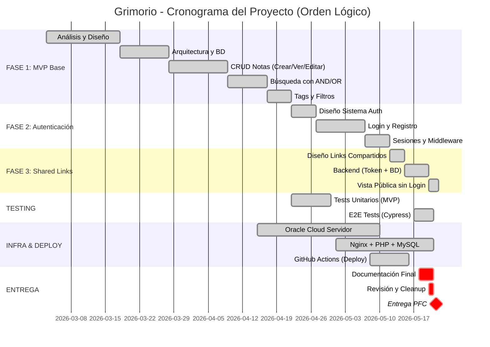
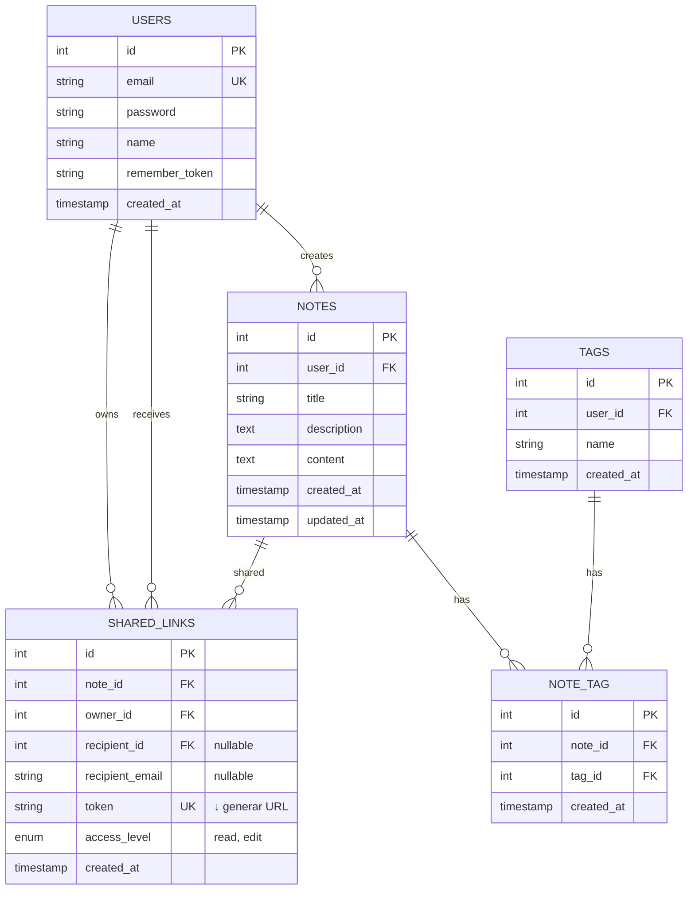
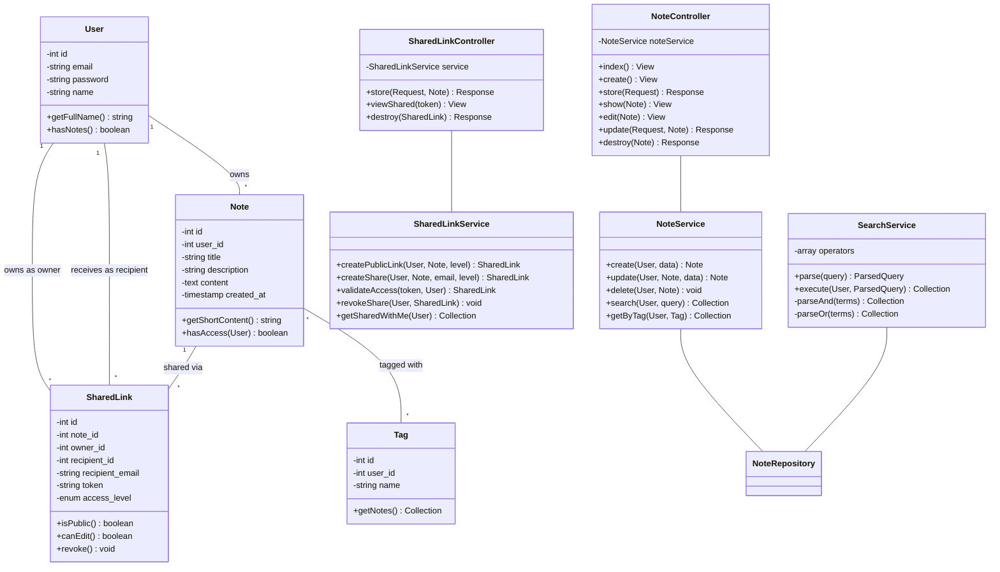
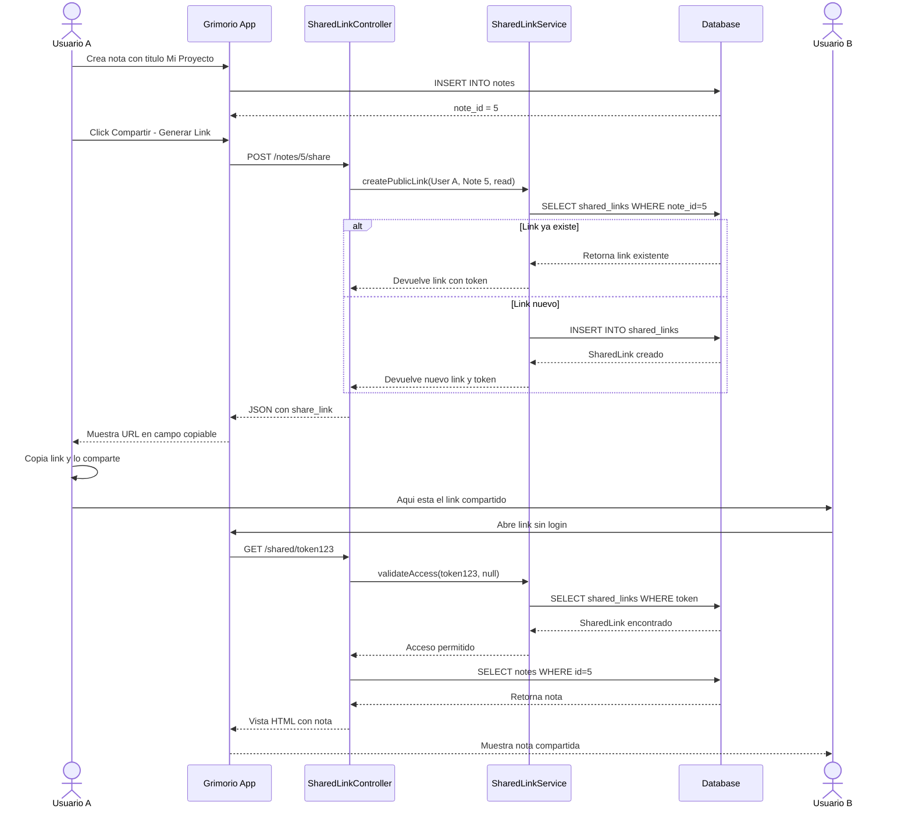
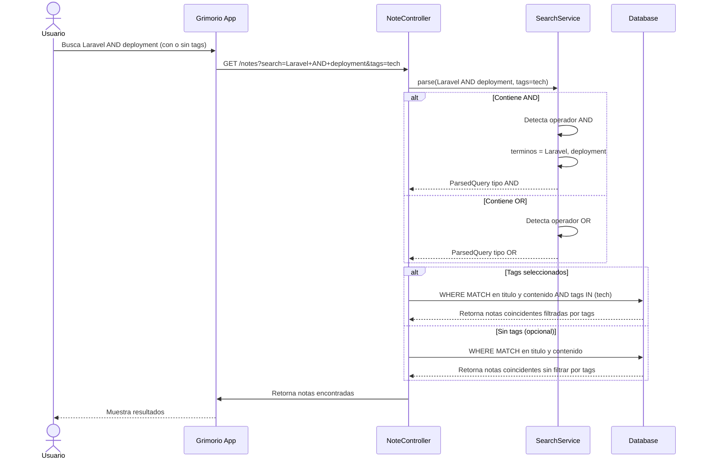

# Diagramas - Grimorio

## 1. Diagrama de Gantt (03/03/26 - 20/05/26)



**Explicación de tareas:**

| Fase | Tarea | Qué Significa |
|------|-------|---------------|
| **MVP** | Análisis y Diseño | Planificación, diseño de BD, requisitos |
| | CRUD Notas | Crear, leer, editar, eliminar notas |
| | Búsqueda con AND/OR | Buscar "Laravel AND deployment" |
| | Tags y Filtros | Sistema de etiquetado de notas |
| | Tests Unitarios | Pruebas de funciones individuales |
| **Auth** | Autenticación y Login | Registro y login de usuarios |
| | Sistema de Sesiones | Mantener usuarios logueados |
| **Shared Links** | Diseño Links Compartidos | Planificación del sistema de compartición |
| | Backend (Token + BD) | Crear tokens únicos, guardar en BD |
| | Vista Pública sin Login | Permitir ver notas compartidas sin estar registrado |
| | E2E Tests | Pruebas completas (crear → compartir → ver) |
| **Infra** | Oracle Cloud Servidor | Máquina virtual en la nube |
| | Nginx + PHP + MySQL | Instalar servidores web y BD |
| | GitHub Actions | Despliegue automático en cada push |
| **Entrega** | Documentación Final | Memoria, diagramas, guías |
| | Revisión y Cleanup | Revisar código, limpiar logs |
| | Entrega PFC | Fecha final de presentación |

**Cómo verlo:** Copia el código anterior y pégalo en https://mermaid.live/

---

## 2. Diagrama Entidad-Relación



**Nota sobre SharedLinks y URLs:**

El URL compartido **NO se almacena en la BD**. En su lugar, almacenamos el `token` (una cadena única de 64 caracteres hexadecimales). El URL se construye dinámicamente en la aplicación:

```
URL compartido = http://51.170.49.16/shared/{token}

Ejemplo:
- token en BD: "a1b2c3d4e5f6a7b8c9d0e1f2a3b4c5d6e7f8a9b0c1d2e3f4a5b6c7d8e9f0"
- URL generado: "http://51.170.49.16/shared/a1b2c3d4e5f6a7b8c9d0e1f2a3b4c5d6e7f8a9b0c1d2e3f4a5b6c7d8e9f0"
```

**Ventajas de esta arquitectura:**
- El URL es único porque el `token` es único (clave única UK)
- El token es criptográficamente seguro (imposible adivinar)
- Se puede revocar el acceso simplemente eliminando la fila de `shared_links`
- No hay rutas "amigables" (no se necesitan mapeos extra en la BD)
- Un mismo token = un único link compartido

---

## 3. Diagrama de Clases



**Explicación del Diagrama de Clases:**

Este diagrama muestra la arquitectura en capas de la aplicación, separando modelos, servicios y controladores:

Modelos (Entidades de BD):
- User: Representa un usuario del sistema. Tiene email, contraseña y nombre. Métodos para obtener datos del perfil.
- Note: Representa una nota. Cada nota tiene un propietario (user_id), título, descripción y contenido. El método `hasAccess()` verifica si un usuario puede acceder a esa nota.
- Tag: Etiqueta para categorizar notas. Un usuario puede tener múltiples tags, y cada tag tiene múltiples notas.
- SharedLink: Representa un link compartido. Conecta una nota con un usuario propietario (owner_id), un receptor opcional (recipient_id), o una dirección de email. Tiene un token único y nivel de acceso (read/edit).

Servicios (Lógica de Negocio):
- NoteService: Contiene toda la lógica de operaciones con notas (crear, actualizar, eliminar, buscar por tags). Los controladores delegan aquí, no acceden directo a la BD.
- SearchService: Especializado en búsquedas. Parsea operadores como "AND" y "OR", y convierte queries del usuario en búsquedas optimizadas en la BD.
- SharedLinkService: Maneja todo lo relacionado con compartición. Crea links públicos, valida acceso mediante token, revoca permisos, etc.

Controladores (Request/Response):
- NoteController: Maneja las rutas HTTP de notas (GET /notes, POST /notes, etc.). Recibe requests, delega a `NoteService`, retorna vistas o JSON.
- SharedLinkController: Maneja rutas de compartición (POST /notes/{id}/share, GET /shared/{token}, DELETE /shared/{id}). Similar a NoteController pero para links.

Relaciones entre clases:
- Los Controllers dependen de los Services (inyección de dependencia)
- Los Services acceden a la BD mediante un Repository (interfaz abstracta)
- Los Models representan tablas de BD y definen relaciones entre ellas
- Las relaciones entre models (User → Note → Tag → SharedLink) son las mismas que en el diagrama ER

Flujo típico:
1. Usuario accede a `/notes/5/edit` 
2. `NoteController::edit()` es llamado
3. Delega a `NoteService::findById(5)`
4. `NoteService` verifica permisos y accede a la BD
5. Retorna la vista con los datos de la nota

Este patrón mantiene el código limpio, testeable y reutilizable.

---

## 4. Diagrama de Secuencia - Compartir Link Público



---

## 5. Diagrama de Secuencia - Busqueda con Operadores y Tags



**Explicación:**
- **Con AND (Todas las palabras):** Usuario escribe "Laravel AND deployment" → busca notas que contengan TODAS las palabras especificadas
- **Con OR (Cualquiera de las palabras):** Usuario escribe "Laravel OR Python" → busca notas que contengan CUALQUIERA de las palabras especificadas
- **Con Tags (Opcional):** Los tags actúan como filtro adicional → solo muestra notas que coincidan con el texto Y que tengan esos tags asignados. Si no selecciona tags, busca en todas las notas sin filtrar
- **Sin Tags:** Si el usuario no selecciona ningún tag, devuelve todas las notas que coincidan con el criterio de búsqueda (AND/OR)

---

## Cómo usar estos diagramas:

1. **Opción A - Visualizar online:**
   - Ve a https://mermaid.live/
   - Copia cualquier bloque de código (entre ```)
   - Pégalo en el editor
   - Haz screenshot para la memoria

2. **Opción B - Convertir a imagen:**
   - Desde mermaid.live, haz click en "Export"
   - Descarga como PNG o SVG
   - Inserta en Word

3. **Opción C - Usar extensión en VS Code:**
   - Instala "Markdown Preview Mermaid Support"
   - Abre este archivo en VS Code
   - Los diagramas se verán directamente

---

**Nota:** Los códigos están listos para usar en la memoria. Solo necesitas elegir cómo visualizarlos e insertarlos como imágenes.
